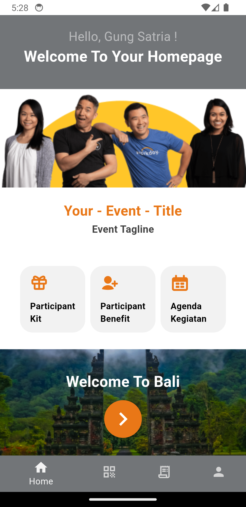
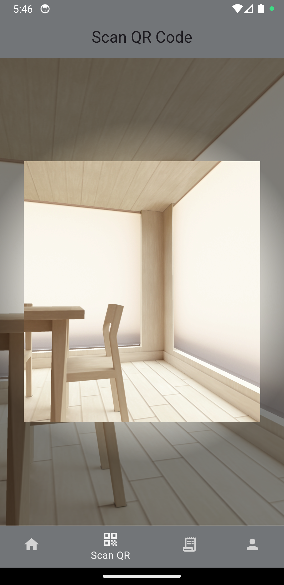

  

# Kopa Event Organizer App

Kopa Event Organizer App is a mobile application built to streamline event management and coordination. Designed with Flutter and powered by Firebase, this app provides tools for organizers to manage participants, handle attendance, and share event information efficiently.

## 📱 Features

- ✅ **Participant Attendance**  
  Mark and track participant presence digitally.

- 📷 **QR Code Scanning**  
  Scan participant QR codes for quick and secure check-ins.

- 🔐 **Access Control**  
  Manage access levels for different users such as committee members and general participants.

- 🗓️ **Event Information**  
  Display important event details such as date, time, location, and guidelines.

## 📸 Screenshots

  
  &nbsp;&nbsp;&nbsp;
  

## 🛠️ Tech Stack

- **Flutter** – UI development for mobile platforms.  
- **Firebase Authentication** – Secure login and role-based access.  
- **Firebase Firestore** – Real-time database for storing participant and event data.  
- **Firebase Storage** – Stores images like participant QR codes.  
- **QR Scanner Package** – Used for scanning participant codes.
